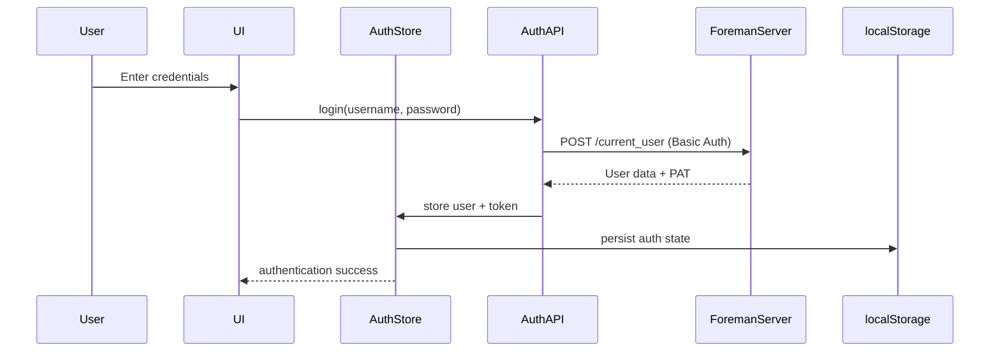

# Foreman UI Authentication & Authorization Guide

This document provides a comprehensive guide to understanding how authentication and authorization work in the Foreman UI, common failure patterns, and troubleshooting approaches.

## Table of Contents

1. [Overview](#overview)
2. [Authentication Flow](#authentication-flow)
3. [Authorization System](#authorization-system)
4. [API Client Architecture](#api-client-architecture)
5. [Common Issues & Troubleshooting](#common-issues--troubleshooting)
6. [Security Considerations](#security-considerations)
7. [Development Guidelines](#development-guidelines)

## Overview

The Foreman UI uses a **Personal Access Token (PAT) authentication system** with session fallback for compatibility:

- **Personal Access Tokens (PAT)**: Primary authentication method using Basic auth format
- **Session-based Auth**: Fallback for endpoints that don't support PAT authentication
- **Permission-based Authorization**: Role-based access control inherited from Foreman

### Key Design Principles

1. **PAT-First with Basic Auth**: All API requests use Personal Access Tokens with `Basic username:token` format
2. **No Cookie Interference**: Session cookies are explicitly excluded from API requests
3. **Graceful Degradation**: Authentication failures are handled without disrupting user experience
4. **Reactive Auth State**: API clients automatically update when authentication state changes

### Critical Authentication Format

**✅ Correct PAT Authentication:**
```http
Authorization: Basic base64(username:token)
```

**❌ Incorrect PAT Authentication:**
```http
Authorization: Bearer token
```

Foreman's `try_to_login` method in `app/models/user.rb` expects PATs to be passed as the password in Basic authentication, not as Bearer tokens.

## Authentication Flow

### 1. Login Process



#### Login Implementation

**Traditional Username/Password Login:**
```typescript
// packages/shared/src/api/auth.ts
async login(credentials: LoginCredentials): Promise<AuthResponse> {
  // Step 1: Validate credentials with Basic Auth
  const response = await fetch('/current_user', {
    headers: { 'Authorization': `Basic ${btoa(`${username}:${password}`)}` },
    credentials: 'omit' // No cookies sent
  });
  
  // Step 2: Generate PAT for subsequent requests
  const patResponse = await this.generatePersonalAccessToken();
  
  return { user: userData, token: patResponse.token };
}
```

**Personal Access Token Login:**
```typescript
async loginWithToken(token: string): Promise<User> {
  // Validate token by fetching user data
  const response = await this.client.get('/current_user');
  return response;
}
```

### 2. Token Storage & Management

**Auth Store State:**
```typescript
interface AuthState {
  user: User | null;        // Contains user.login for PAT auth
  token: string | null;     // Raw PAT token
  isAuthenticated: boolean;
  isLoading: boolean;
  error: string | null;
}
```

**Storage Strategy:**
- **Zustand Store**: In-memory state for reactive components
- **localStorage**: Persistent auth state including user object
- **Automatic Sync**: Store updates trigger API client recreation

### 3. API Client Authentication

```typescript
// packages/shared/src/api/client.ts
private setupInterceptors() {
  this.client.interceptors.request.use((config) => {
    if (this.token) {
      try {
        const decoded = atob(this.token);
        if (decoded.includes(':')) {
          // This is base64-encoded username:password - use as-is
          config.headers.Authorization = `Basic ${this.token}`;
        } else {
          // This is a Personal Access Token - need username:token format
          const authData = localStorage.getItem('foreman-auth');
          const username = JSON.parse(authData)?.state?.user?.login;
          
          if (username) {
            // Use Basic auth with username:token format (required by Foreman)
            const basicAuth = btoa(`${username}:${this.token}`);
            config.headers.Authorization = `Basic ${basicAuth}`;
          }
        }
      } catch {
        // Handle PAT authentication with fallback
      }
    }
  });
}
```

## Authorization System

### 1. Permission Model

Foreman uses a **role-based permission system**:

```typescript
interface User {
  admin: boolean;           // Superuser flag
  roles: Role[];           // Assigned roles
}

interface Role {
  name: string;            // Role identifier
  permissions: Permission[]; // Granted permissions
}

interface Permission {
  name: string;            // Permission name (e.g., "view_hosts")
  resource_type?: string;  // Optional resource scope (e.g., "Host")
}
```

### 2. Permission Checking

**Admin Users:**
- `admin: true` users bypass all permission checks
- Have access to all functionality regardless of roles

**Regular Users:**
- Must have explicit permissions for each action
- Permissions are checked by `name` and optional `resource_type`

**Implementation:**
```typescript
// packages/shared/src/auth/store.ts
hasPermission: (permission: string, resource?: string) => {
  if (!user || !isAuthenticated) return false;
  if (user.admin) return true; // Admins bypass all checks
  
  return user.roles.some(role =>
    role.permissions?.some(perm =>
      perm.name === permission &&
      (!resource || perm.resource_type === resource)
    )
  );
}
```

### 3. Component-Level Authorization

**Hook-Based Protection:**
```typescript
const { hasPermission } = useAuth();
const canViewHosts = hasPermission('view_hosts');
const canCreateHosts = hasPermission('create_hosts', 'Host');

// Query enabled based on permissions
const { data: hosts } = useHosts({
  enabled: canViewHosts
});
```

## API Client Architecture

### 1. Client Creation & Configuration

```typescript
// packages/shared/src/api/client.ts
export class ForemanAPIClient {
  constructor(config: ClientConfig) {
    this.client = axios.create({
      baseURL: config.baseURL,
      withCredentials: false, // CRITICAL: Prevent session cookies
      headers: {
        'Accept': 'application/json',
        'Content-Type': 'application/json'
      }
    });
    
    if (config.token) {
      this.setToken(config.token);
    }
  }
}
```

### 2. Token Management

**Setting Tokens:**
```typescript
setToken(token: string) {
  this.token = token;
  // Authentication header set by request interceptor
  // using username:token Basic auth format
}

clearToken() {
  this.token = null;
}
```

### 3. Error Handling & Auth Failures

```typescript
// Response interceptor for 401 handling
this.client.interceptors.response.use(
  (response) => response,
  (error) => {
    if (error.response?.status === 401) {
      const url = error.config?.url || '';
      
      if (url.includes('/notification_recipients')) {
        // Notification auth failure - handle gracefully
        console.warn('Notification authentication failed');
        return Promise.reject(error);
      } else if (url.includes('/current_user')) {
        // Login failure - clear auth and redirect
        this.clearToken();
        window.location.href = '/login';
      } else {
        // General API failure - session expired
        this.clearToken();
        setTimeout(() => window.location.href = '/login', 1000);
      }
    }
    return Promise.reject(error);
  }
);
```

## Common Issues & Troubleshooting

### 1. **401 Errors Shortly After Login** ✅ FIXED

**Problem:** API requests failing with 401 immediately after successful login

**Root Cause:** PAT authentication was using Bearer tokens instead of Basic auth

**Solution:** Updated API client to use `Basic base64(username:token)` format:
```typescript
// Before: Incorrect Bearer format
Authorization: Bearer DYrIJTYXnbhHQGEv...

// After: Correct Basic format  
Authorization: Basic base64(username:DYrIJTYXnbhHQGEv...)
```

### 2. **PAT Authentication Format Issues**

**Problem:** Foreman returns 401 for valid PAT tokens

**Root Cause:** Incorrect authentication header format

**Diagnostic Test:**
```javascript
const token = localStorage.getItem('foreman_auth_token');
const username = 'your_username';

// Test Bearer (will fail)
fetch('/api/v2/current_user', {
  headers: { 'Authorization': `Bearer ${token}` },
  credentials: 'omit'
}).then(r => console.log('Bearer:', r.status));

// Test Basic user:token (will succeed)
fetch('/api/v2/current_user', {
  headers: { 'Authorization': `Basic ${btoa(`${username}:${token}`)}` },
  credentials: 'omit'
}).then(r => console.log('Basic user:token:', r.status));
```

### 3. **Session Cookie Conflicts** ✅ ADDRESSED

**Problem:** Session cookies interfering with PAT authentication

**Solution:** Set `withCredentials: false` on all API clients and handle gracefully:
```typescript
axios.create({
  withCredentials: false, // Prevents session cookies
});
```

### 4. **Race Conditions with Auth State** ✅ FIXED

**Problem:** API clients created before auth state is available

**Solution:** Made `useApi` hook reactive to auth state changes:
```typescript
// packages/shared/src/hooks/useApi.ts
export const useApi = () => {
  const { token, isAuthenticated } = useAuthStore();
  
  return useMemo(() => {
    const client = createDefaultClient();
    return { hosts: new HostsAPI(client), /* ... */ };
  }, [token, isAuthenticated]); // Recreate when auth changes
};
```

### 5. **Permission Denied Errors**

**Problem:** Users seeing "Access Denied" for actions they should have access to

**Diagnostic Approach:**
```typescript
// Check user permissions
const { user, hasPermission } = useAuth();
console.log('User roles:', user?.roles);
console.log('User permissions:', user?.roles?.flatMap(r => r.permissions));
console.log('Can view hosts:', hasPermission('view_hosts'));

// Check admin status
console.log('Is admin:', user?.admin);
```

## Security Considerations

### 1. **Authentication Method Security**

**PAT vs Session Security:**
- **PATs**: No expiration (unless set), more secure for API access
- **Sessions**: Automatic expiration, better for interactive use
- **Hybrid Approach**: Use PATs for API, sessions for specific endpoints

### 2. **Token Storage**

**localStorage Security:**
- Tokens stored in localStorage (XSS vulnerable)
- Mitigation: Strong CSP headers, input sanitization
- Alternative: Consider httpOnly cookies for tokens (future enhancement)

**Token Lifecycle:**
- Tokens cleared on logout
- Session cookies explicitly cleared
- Username stored separately for PAT authentication

### 3. **Error Information Disclosure**

**Safe Error Handling:**
- Generic "authentication failed" messages to users
- Detailed errors only in console/logs
- No sensitive token information in error responses

## Development Guidelines

### 1. **Adding New API Endpoints**

```typescript
// Always use the configured API client
export class NewAPI {
  constructor(private client: ForemanAPIClient) {}
  
  async getData(): Promise<ResponseType> {
    // Client handles PAT authentication automatically
    return this.client.get('/new-endpoint');
  }
}

// Register in useApi hook
export const useApi = () => {
  const { token, isAuthenticated } = useAuthStore();
  
  return useMemo(() => {
    const client = createDefaultClient();
    return {
      // existing APIs...
      newApi: new NewAPI(client),
    };
  }, [token, isAuthenticated]);
};
```

### 2. **Permission-Protected Components**

```typescript
const ProtectedFeature = () => {
  const { hasPermission } = useAuth();
  
  if (!hasPermission('required_permission')) {
    return <AccessDenied />;
  }
  
  return <FeatureContent />;
};
```

### 3. **Handling Auth in Tests**

```typescript
// Mock auth state
const mockAuthStore = {
  user: { id: 1, login: 'testuser', admin: false, roles: [...] },
  token: 'test-pat-token',
  isAuthenticated: true,
  hasPermission: vi.fn().mockReturnValue(true)
};

// Mock API clients
vi.mock('../api/client', () => ({
  createDefaultClient: () => mockClient
}));
```

### 4. **Testing PAT Authentication**

```typescript
// Test PAT format in development
const testPATAuth = async () => {
  const token = localStorage.getItem('foreman_auth_token');
  const authData = localStorage.getItem('foreman-auth');
  const username = JSON.parse(authData)?.state?.user?.login;
  
  if (token && username) {
    const basicAuth = btoa(`${username}:${token}`);
    const response = await fetch('/api/v2/current_user', {
      headers: { 'Authorization': `Basic ${basicAuth}` },
      credentials: 'omit'
    });
    console.log('PAT authentication test:', response.status);
  }
};
```

## Quick Reference

### Authentication Formats
```typescript
// Login (username:password)
Authorization: Basic base64(username:password)

// PAT (username:token)  
Authorization: Basic base64(username:token)

// Session cookies (not used in API)
Cookie: _foreman_session=...
```

### Common Auth Checks
```typescript
const { user, isAuthenticated, hasPermission } = useAuth();

// Basic auth check
if (!isAuthenticated) return <LoginPrompt />;

// Admin check
if (user?.admin) return <AdminPanel />;

// Specific permission
if (hasPermission('view_hosts')) return <HostsList />;

// Resource-specific permission
if (hasPermission('edit_hosts', 'Host')) return <EditHostForm />;
```

### Debugging Auth Issues
```typescript
// Check current auth state
console.log('Auth State:', useAuthStore.getState());

// Check stored token and username
const authData = localStorage.getItem('foreman-auth');
const token = localStorage.getItem('foreman_auth_token');
console.log('Auth data:', JSON.parse(authData || '{}'));
console.log('Token:', token);

// Test API connectivity with proper auth
const client = createDefaultClient();
client.get('/current_user').catch(console.error);
```

---

This documentation reflects the current implementation where PAT authentication uses Basic auth with `username:token` format, as required by Foreman's authentication system.